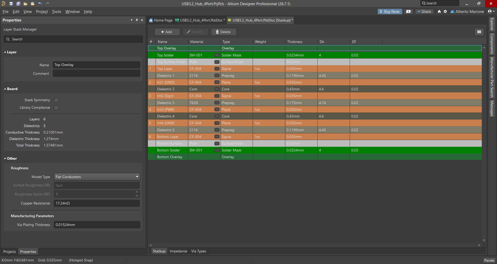

# ⚡ USB 3.2 Gen 1 — 4-Port Hub

<p align="left">
  
  
  
  
  
</p>

---

## 📋 Project Summary

This repository contains the complete hardware design for a USB 3.2 Gen 1 (5 Gbps) 4-port hub, designed as a portfolio project demonstrating high-speed PCB design methodology on a real-world USB system.

The hub is fully bus-powered over USB-C (UFP, up to 3A) and provides one USB-C downstream port with cold-socket via P-MOSFET logic, plus three USB-A downstream ports, all with per-port current limiting. No MCU is required: Type-C attach detection, power sequencing, and overcurrent protection are handled entirely in hardware.

The design focuses on:

- **Impedance-controlled routing** (90Ω differential, 6-layer stackup)
- **Hierarchical schematic** with multi-part component decomposition (TUSB8044A split across 5 sub-sheets)
- **Power delivery chain** with PG-chained sequencing and RC-delayed reset
- **USB-C cold socket implementation** using P-MOSFET gate logic (no VBUS before cable insertion, per USB Type-C specification)

---


🔗 **Schematic (PDF):** [View full schematic](Hardware/Exports/Schematic_USB_Hub_v1.0.pdf)

---

## 🔧 Key Specifications

| Parameter | Value |
|---|---|
| **Hub Controller** | TUSB8044A - USB 3.2 Gen 1 Hub controller, 64-pin VQFN |
| **Upstream Port** | USB-C (UFP/Sink, bus-powered, 5V/3A max) |
| **Downstream Ports** | 1× USB-C (DFP) + 3× USB-A |
| **Type-C Controllers** | 2× HD3SS3220IRNHT (UFP and DFP) |
| **Power Switches** | 2× TPS2561QDRCRQ1 (dual-channel, per-port current limiting) |
| **Power Tree** | 5V → 3.3V: TLV62569PDDCT (buck, 2A) → 1.1V: TPS74801RGWRM3 (LDO, 1.5A) |
| **Battery Charging** | BC 1.2 CDP enabled on all downstream ports |
| **Cold Socket** | Hardware P-MOSFET on USB-C downstream port |
| **PCB Layers** | 6-layer controlled-impedance |
| **Board Size** | 100 × 50 mm |
| **Design Tool** | Altium Designer 26 |

---

## 🏆 Hardware Engineering Highlights

### ⚡ SuperSpeed Signal Integrity

- All SS differential pairs routed on **L1 and L6 only**, each with an adjacent solid GND plane (L2 and L5) as the impedance reference.
- **Differential impedance: 90Ω ±10%**, calculated with Altium's built-in field solver on the 6-layer stackup.
- Prepreg L1–L2 and L5–L6: **2116, 0.12mm, Dk = 4.45**.
- **5W clearance rule (0.6mm)** enforced between SS/HS pairs and all other signals and copper pours.
- **Intra-pair skew ≤ 0.15mm** (≈ 1.2 ps) on all SuperSpeed pairs.
- AC coupling caps (100nF, 0402, X7R) on TX paths.
- **Polarity inversion** applied where needed: both TUSB8044A and HD3SS3220 support it natively, no via swaps required.

| Impedance Profile | Stackup |
|:---:|:---:|
|  |  |

### 🧱 6-Layer Stackup

| Layer | Type | Function |
|---|---|---|
| L1 | Signal | USB SS/HS pairs, components |
| L2 | GND Plane | Solid reference, no splits |
| L3 | Signal | Slow signals only |
| L4 | Power | Polygon pours: 5V / 3.3V / 1.1V |
| L5 | GND Plane | Solid reference, no splits |
| L6 | Signal | USB SS/HS pairs, routing |


### 🔌 USB-C Cold Socket

Per USB Type-C specification, the downstream USB-C port VBUS must be de-energized when no cable is inserted. This is implemented with a single P-MOSFET (DMG2305UX) acting as a hardware AND gate:

- **Source** → PWRCTL1 from TUSB8044A (3.3V when hub active)
- **Gate** → ID pin of HD3SS3220 DFP
- **Drain** → EN1 of TPS2561 power switch

When no cable is present, the ID pin floats and the 100kΩ Gate-Source resistor keeps the MOSFET off, VBUS stays at 0V. On cable insertion, HD3SS3220 pulls ID LOW, turning on the MOSFET and enabling VBUS. USB-A ports use direct PWRCTL→EN connections (hot socket, per spec).

### 🔋 Power Sequencing

### 🛡️ ESD Protection

| Location | Component | Protection |
|---|---|---|
| SS lines (all ports) | PUSB3FR4Z (Nexperia) | 0.29pF |
| USB 2.0 + CC lines | TPD4E05U06 (TI) | 0.5pF |
| VBUS (all ports) | SMAJ5.0A | TVS, clamps surges |

---

## 📁 Repository Structure

```text
USB3.2-Hub-4Port/
│
├── Images/
│   ├── PCB_3D.png
│   ├── PCB_3D_Top.png
│   ├── PCB_3D_Bottom.png
│   ├── Layerstack_Visualizer.png
│   ├── Stackup.png
│   ├── D90_Impedance_Profile.png
│   └── Schematic_Overview.png
│
├── Hardware/
│   ├── Altium/
│   │   ├── USB3.2_Hub_4Port.PrjPcb
│   │   ├── USB3.2_Hub_4Port.PcbDoc
│   │   ├── Top_Level.SchDoc
│   │   ├── Hub_Core.SchDoc
│   │   ├── Power.SchDoc
│   │   ├── Upstream.SchDoc
│   │   ├── Downstream_Port_1.SchDoc
│   │   ├── Downstream_Port_2.SchDoc
│   │   ├── Downstream_Port_3-4.SchDoc
│   │   ├── USB3.2_Hub_4Port.BomDoc
│   │   ├── USB3.2_Hub_4Port.PrjPcbVariants
│   │   └── USB3.2_Hub_4Port.PrjPcbStructure
│   │
│   └── Exports/
│       ├── Schematic_USB_Hub_v1.0.pdf
│       └── Draftsman_USB_Hub_v1.0.pdf
│
├── Manufacturing/
│   ├── Gerbers/
│   │   └── Gerber_USB3.2_Hub_4Port_v1.0.zip
│   │
│   ├── Assembly/
│   │   ├── BOM.xlsx
│   │   └── PickPlace.csv
│   │
│   └── Stackup/
│       ├── PCBWay_6Layer_Stackup.pdf
│       └── USB3.2_Hub_4Port_Stackup.png
│
├── Docs/
│   ├── Design_Notes.md
│   ├── Routing_Guidelines.md
│   └── Bringup.md
│
└── README.md
```

---

## 🛠️ Tools Used

| Tool | Version | Purpose |
|---|---|---|
| **Altium Designer** | 26.7.1 | Schematic capture, 6-layer PCB layout |

---

## ⚠️ Disclaimer

This project is provided for educational and portfolio purposes. The board has not yet been manufactured or tested. The author assumes no liability for any issues arising from the use of this material.

---

## 👤 Author

**Alberto Marrone**
[LinkedIn](your-linkedin-url)


# ⚡ USB 3.2 Gen 1 — 4-Port Hub

<p align="left">
  
  
  
  
</p>

<p align="center">
  
</p>

---

## 📋 Project Overview

This project is a fully bus-powered USB 3.2 Gen 1 (5 Gbps) hub built around
the Texas Instruments **TUSB8044A** hub controller.

The goal was to design and lay out a real-world high-speed digital system
end-to-end — from controller and topology selection, through
impedance-controlled routing, to manufacturing — covering:

- USB 3.2 SuperSpeed signal routing with controlled differential impedance
- USB-C upstream and downstream ports with **hardware-only Type-C logic** (no MCU)
- Multi-rail power delivery with sequenced enable timing
- 6-layer PCB stackup selection and the signal integrity tradeoffs behind it

It was developed as a personal hardware engineering project to gain hands-on
experience with high-speed routing, power sequencing, ESD protection, and
design-for-manufacturing on a board complex enough to require real
engineering tradeoffs.

> [!NOTE]
> **Hardware Revision:** Rev A · **Status:** Manufacturing & Assembly (PCBWay)
> · **Validation:** Pending — results and assembled board photos will be
> added once the boards arrive.

---

## 🧩 Board Features

- USB 3.2 Gen 1 (5 Gbps) — 4 downstream ports: 1× USB-C (DFP) + 3× USB-A
- Fully bus-powered over USB-C upstream (UFP, 5V/3A max), no external supply
- Entirely hardware-driven Type-C attach detection — **no MCU**
- USB-C cold-socket VBUS gating per Type-C specification
- Per-port current limiting with overcurrent protection
- BC1.2 (CDP) battery charging support on all downstream ports
- 6-layer impedance-controlled PCB — 90Ω differential SS/HS pairs
- ESD protection on all USB data lines, CC lines, and VBUS

---

## 🏆 Design Challenges

### 📡 Signal Integrity — 90Ω Differential Impedance

All SuperSpeed and High-Speed differential pairs are routed exclusively on
**L1 and L6**, each directly referenced to a solid, unbroken GND plane (L2
and L5). Routing follows the 5W rule — a minimum of 0.6mm clearance between
any differential pair and other signals or copper pour, to keep nearby
copper from acting as a parasitic coplanar ground and shifting the
impedance off target.

| Parameter | SuperSpeed (USB 3.x) | High-Speed (USB 2.0) |
|---|---|---|
| Target differential impedance | 90Ω ±10% | 90Ω ±10% |
| Trace width / gap | 0.136mm / 0.127mm | per Altium field solver |
| Intra-pair skew | ≤ 0.15mm (≈1.2ps) | ≤ 3.8mm |
| Max via count per pair | 2 | 4 |
| AC coupling | 100nF, 0402, X7R — TX paths only | — |

With the 2116 prepreg (0.12mm, Dk = 4.45) between L1–L2 and L5–L6, the field
solver converges to **90.03Ω** — a 0.04% deviation from target.

<p align="center">
  
</p>

> [!TIP]
> Both the TUSB8044A and HD3SS3220 support **native polarity inversion** on
> SuperSpeed pairs — P/N can be swapped freely during routing with no via
> tricks or register configuration required.

---

### 🧱 6-Layer Stackup Selection

| Layer | Type | Function |
|---|---|---|
| L1 | Signal | USB SS/HS pairs, components |
| L2 | GND Plane | Solid reference, no splits |
| L3 | Signal | Slow signals only (I2C, PWRCTL, OVERCUR, GRSTz) |
| L4 | Power | Polygon pours: 5V / 3.3V / 1.1V |
| L5 | GND Plane | Solid reference, no splits |
| L6 | Signal | USB SS/HS pairs, routing |

Both signal layers carrying SuperSpeed traffic (L1 and L6) sit directly
against a solid GND plane — there is no plane split for an SS pair to cross
on either outer layer. Slow control signals are confined to L3, sandwiched
between a GND plane (L2) and the power plane (L4), shielding them from both
the high-speed layers and external noise.

<p align="center">
  
  
</p>

> [!NOTE]
> The prepreg between L1–L2 and L5–L6 uses **2116 weave** instead of the
> coarser 7628. The finer glass weave reduces the fiber-weave effect,
> keeping the dielectric more homogeneous under the SuperSpeed pairs and
> minimizing intra-pair skew. Full reasoning — including why 6 layers over
> 4, and why an LDO over a second buck for the 1.1V rail — is documented in
> [`Docs/Design_Decisions.md`](Docs/Design_Decisions.md).

---

### 🔌 USB-C Cold Socket Compliance

Per the USB Type-C specification, the downstream USB-C port's VBUS must
remain de-energized until a cable is detected — unlike USB-A ports, which
are permitted to be hot-socket. This is implemented with a single P-MOSFET
(DMG2305UX) acting as a hardware enable gate, requiring no firmware:

- **Source** → PWRCTL1 (TUSB8044A, 3.3V when hub is active)
- **Gate** → ID pin of the downstream HD3SS3220
- **Drain** → EN1 of the TPS2561 power switch

With no cable inserted, the ID pin floats and a 100kΩ gate-source resistor
holds the MOSFET off — VBUS stays at 0V. On attach, the HD3SS3220 detects
the Rd termination on CC and pulls ID low, turning on the MOSFET and
enabling VBUS. The three USB-A ports use direct PWRCTL → EN connections, as
hot-socket behavior is permitted there.

---

### 🔋 Power Delivery Sequencing

> [!IMPORTANT]
> The TUSB8044A requires GRSTz to remain asserted for ≥3ms after both VDD
> (1.1V) and VDD33 (3.3V) enter their recommended operating range.

t = 0ms      VBUS 5V applied
t ≈ 0.5ms    Buck PG releases → LDO EN
t ≈ 3.8ms    LDO soft-start complete (Css = 2.2nF, tSS ≈ 3.3ms)
t ≈ 4.3ms    LDO PG releases → RC delay begins
t ≈ 16ms     GRSTz reaches VIH → TUSB8044A exits reset

The RC delay accounts for the TUSB8044A's internal pull-up on GRSTz
(R_int ≈ 14.5–25kΩ): with an external 100kΩ resistor and a 1µF capacitor,
R_eq ≈ 12.66kΩ gives t(VIH) ≈ 11.8ms — comfortably above the 3ms minimum,
with margin against the internal pull-up's full tolerance range.

---

## 🖼️ Design Gallery

<p align="center">
  
  
</p>

<p align="center">
  
</p>

🔗 **Full schematic (PDF, all sheets):** [Schematic_USB_Hub_v1.0.pdf](Hardware/Exports/Schematic_USB_Hub_v1.0.pdf)

---

## 🔧 Hardware Specifications

| Parameter | Value |
|---|---|
| **Hub Controller** | TUSB8044A — USB 3.2 Gen 1, 5 Gbps, 64-pin VQFN |
| **Upstream Port** | USB-C (UFP/Sink, bus-powered, 5V/3A max) |
| **Downstream Ports** | 1× USB-C (DFP) + 3× USB-A |
| **Type-C Controllers** | 2× HD3SS3220IRNHT (UFP + DFP) |
| **Power Switches** | 2× TPS2561QDRCRQ1 (dual-channel, per-port current limiting) |
| **Power Tree** | 5V → 3.3V (TLV62569PDDCT buck, 2A) → 1.1V (TPS74801RGWRM3 LDO, 1.5A) |
| **Battery Charging** | BC 1.2 CDP enabled on all downstream ports |
| **Cold Socket** | DMG2305UX P-MOSFET on USB-C downstream port |
| **ESD Protection** | PUSB3FR4Z (SS), TPD4E05U06 (USB2.0/CC), SMAJ5.0A (VBUS) |
| **PCB Layers** | 6-layer, impedance-controlled |
| **Board Size** | 100 × 50 mm |
| **Design Tool** | Altium Designer 26 |

---

## 📦 Manufacturing — PCBWay

<p align="left">
  
</p>

This prototype is being manufactured and assembled through a collaboration
with **PCBWay**. During the design review, their engineering team identified
a via-in-pad condition before production — caught and corrected ahead of
fabrication for this 6-layer impedance-controlled run.

Throughout the review process, communication was responsive and detailed,
particularly around impedance-controlled routing requirements, assembly
manufacturability, and stackup verification against the design files below.

<p align="center">
  
</p>

📄 **Manufacturer stackup reference:** [PCBWay_6Layer_Stackup.pdf](Manufacturing/Stackup/PCBWay_6Layer_Stackup.pdf)

> [!NOTE]
> Once the assembled boards arrive and bring-up is complete, this section
> will be updated with photos and an objective assessment of build quality.

---

## ✅ Validation Plan

Once the assembled boards arrive, the following bring-up sequence will be
performed — full procedure in [`Docs/Bringup.md`](Docs/Bringup.md):

- [ ] Visual inspection (solder joints on 0.5mm-pitch QFNs, connectors)
- [ ] Power-on rail verification (5V / 3.3V / 1.1V at test points)
- [ ] GRSTz timing verification (oscilloscope)
- [ ] USB enumeration (VID/PID check)
- [ ] Per-port functional test (USB 2.0 and USB 3.2 devices)
- [ ] Overcurrent / fault LED test per port
- [ ] BC1.2 charging detection test

---

## ⬇️ Downloads

| File | Description |
|---|---|
| [Schematic (PDF)](Hardware/Exports/Schematic_USB_Hub_v1.0.pdf) | Full schematic, all sheets |
| [Draftsman Export (PDF)](Hardware/Exports/Draftsman_USB_Hub_v1.0.pdf) | Stackup, layers, 3D views |
| [Gerbers](Manufacturing/Gerbers/Gerber_USB3.2_Hub_4Port_v1.0.zip) | Production-ready Gerber + drill files |
| [BOM](Manufacturing/Assembly/BOM.xlsx) | Bill of materials |
| [Pick & Place](Manufacturing/Assembly/PickPlace.csv) | Assembly placement file |

---

## 📁 Repository Structure

```text
USB3.2-Hub-4Port/
│
├── Images/
│   ├── PCB_3D.png
│   ├── PCB_3D_Top.png
│   ├── PCB_3D_Bottom.png
│   ├── Layerstack_Visualizer.png
│   ├── Stackup.png
│   ├── D90_Impedance_Profile.png
│   └── Schematic_Overview.png
│
├── Hardware/
│   ├── Altium/
│   │   ├── USB3.2_Hub_4Port.PrjPcb
│   │   ├── USB3.2_Hub_4Port.PcbDoc
│   │   ├── Top_Level.SchDoc
│   │   ├── Hub_Core.SchDoc
│   │   ├── Power.SchDoc
│   │   ├── Upstream.SchDoc
│   │   ├── Downstream_Port_1.SchDoc
│   │   ├── Downstream_Port_2.SchDoc
│   │   ├── Downstream_Port_3-4.SchDoc
│   │   ├── USB3.2_Hub_4Port.BomDoc
│   │   ├── USB3.2_Hub_4Port.PrjPcbVariants
│   │   └── USB3.2_Hub_4Port.PrjPcbStructure
│   │
│   └── Exports/
│       ├── Schematic_USB_Hub_v1.0.pdf
│       └── Draftsman_USB_Hub_v1.0.pdf
│
├── Manufacturing/
│   ├── Gerbers/
│   │   └── Gerber_USB3.2_Hub_4Port_v1.0.zip
│   │
│   ├── Assembly/
│   │   ├── BOM.xlsx
│   │   └── PickPlace.csv
│   │
│   └── Stackup/
│       ├── PCBWay_6Layer_Stackup.pdf
│       └── USB3.2_Hub_4Port_Stackup.png
│
├── Docs/
│   ├── Design_Decisions.md
│   ├── Routing_Guidelines.md
│   └── Bringup.md
│
└── README.md
```

---

## 👤 Author

**Alberto Marrone**
MSc Student, Electronics Engineering — Politecnico di Milano
[LinkedIn](your-linkedin-url) · [GitHub](https://github.com/Alberto0235)

*This project is provided for educational and portfolio purposes.*
