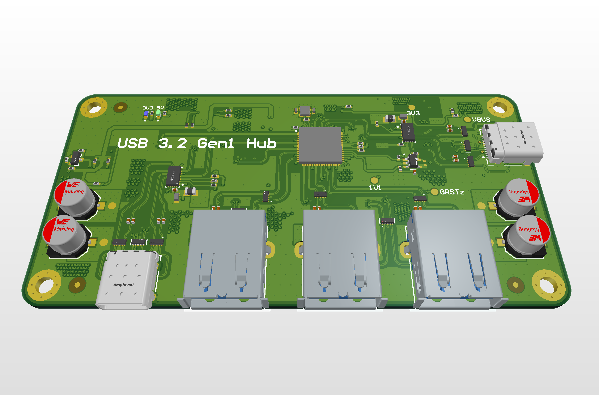
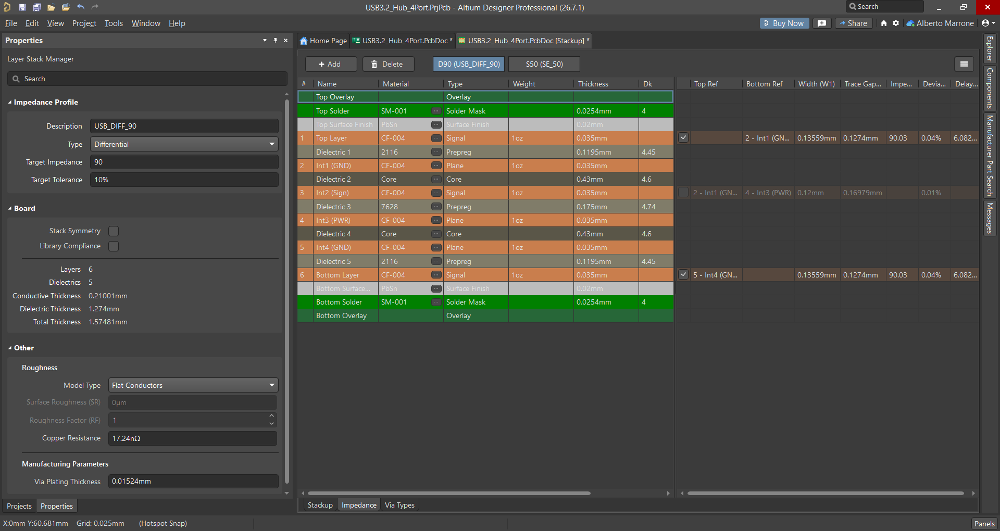
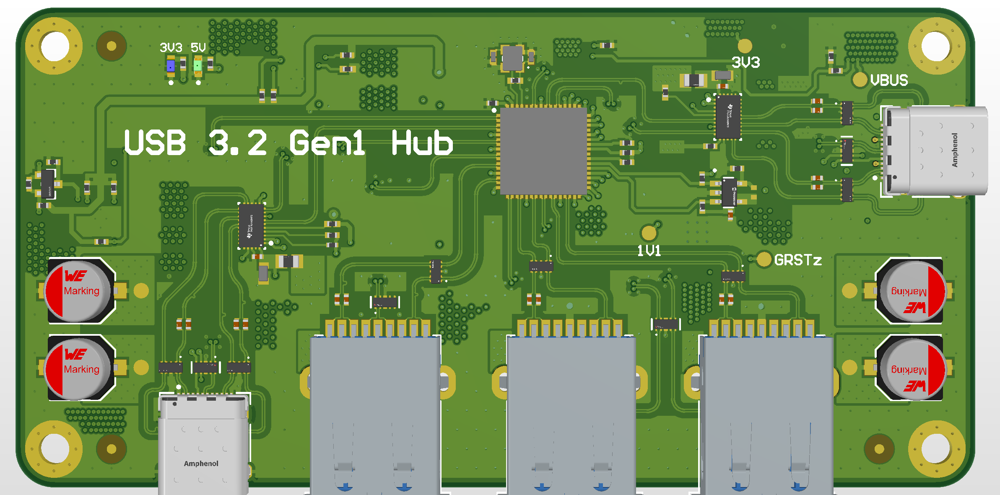
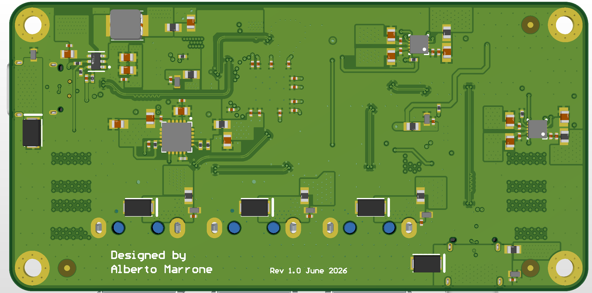
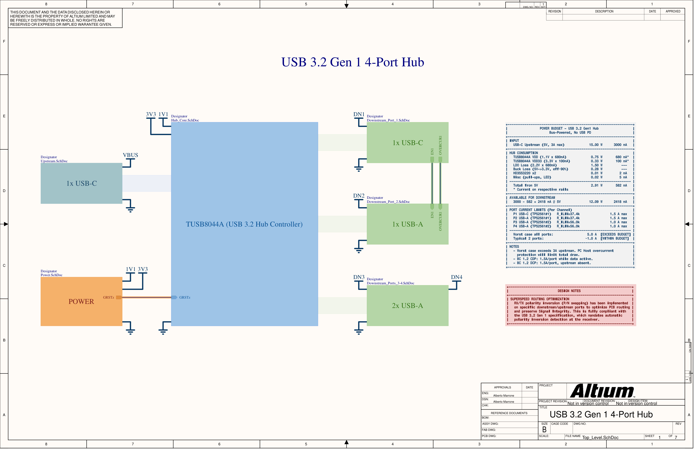
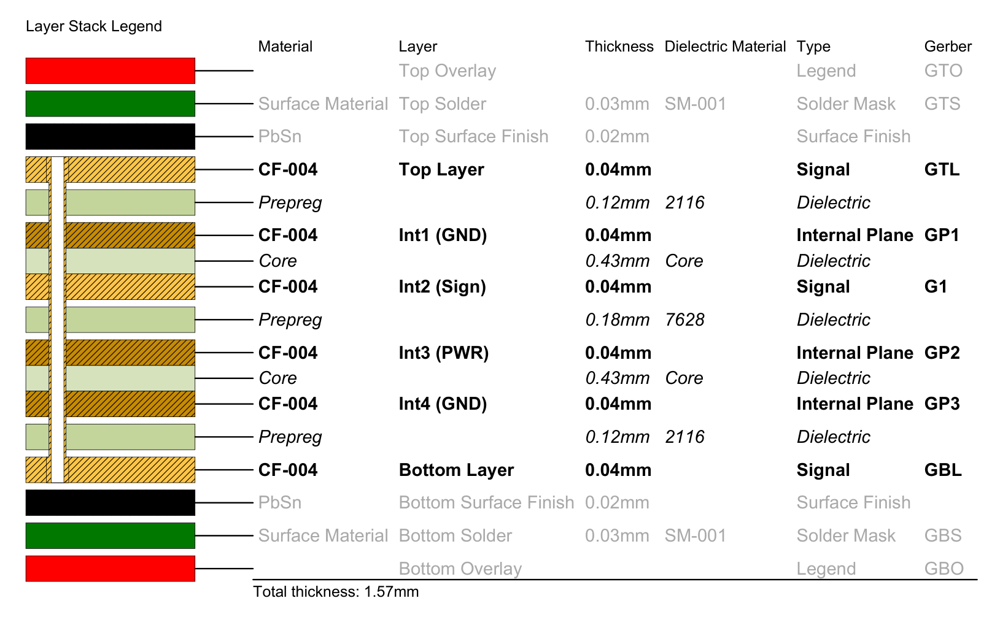
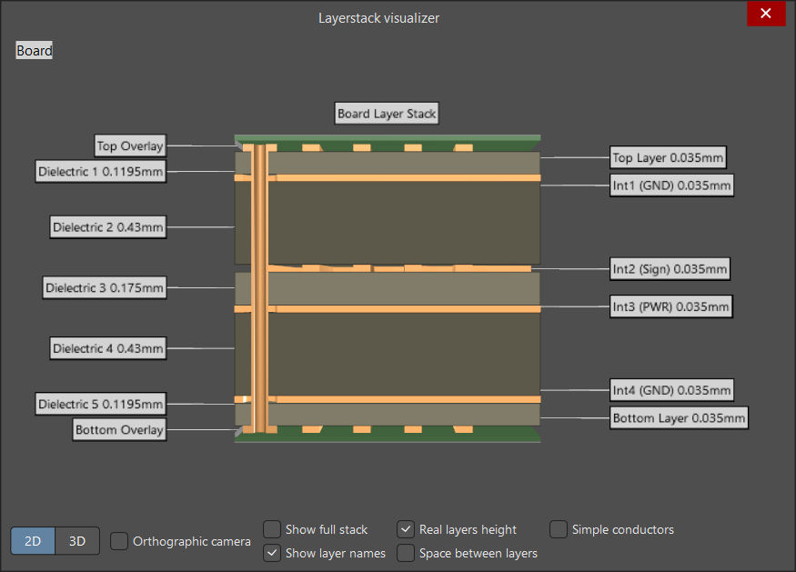

<h1 align="center">⚡ USB 3.2 Gen 1 — 4-Port Hub</h1>

<p align="center">
High-Speed Hardware Design
</p>

<p align="center">
  
  
  
  
</p>

<p align="center">
  
</p>

---

## 🎯 Project Goal

This project started as a question: could I take a commercially relevant USB 3.x system from architecture all the way through to a manufacturable, impedance-controlled 6-layer PCB?

The hub is built around the Texas Instruments **TUSB8044A**, fully bus-powered over USB-C, with one USB-C downstream port (cold-socket compliant) and three USB-A ports, each with independent current limiting. Type-C attach detection, power-up sequencing and overcurrent handling are implemented entirely in hardware, with no microcontroller required.

The areas I specifically wanted to get right:

- Routing 5 Gbps SuperSpeed differential pairs with impedance control
- Understanding the 6-layer stackup advantages
- Implementing USB-C cold socket behavior correctly, in hardware, per spec
- Getting power-up sequencing timing right against the TUSB8044A'sdatasheet requirements

---

## 🚀 Project Status

- [x] Architecture & component selection
- [x] Schematic capture (hierarchical, multi-sheet)
- [x] Signal integrity analysis & stackup design
- [x] PCB layout & routing
- [x] Manufacturing files (Gerbers, BOM, Pick & Place)
- [x] DFM review (PCBWay)
- [ ] PCB fabrication & assembly
- [ ] Bring-up & validation

---

## 🧩 Board Features

| Feature | Description |
|---|---|
| ⚡ USB 3.2 Gen 1 | 5 Gbps SuperSpeed, 4-port hub (TUSB8044A) |
| 🔌 USB-C UFP | Bus-powered upstream, 5V/3A max |
| 🧊 Cold Socket | Hardware VBUS gating on USB-C downstream port |
| 🔋 BC1.2 CDP | Charging support on all downstream ports |
| 🛡️ ESD Protection | All USB data lines, CC lines, and VBUS protected |
| 📡 Controlled Impedance | 90Ω differential SS/HS routing, 6-layer stackup |
| 🔄 Power Sequencing | Hardware-controlled, RC-delayed reset |
| 🧠 No MCU | All Type-C and power logic implemented in hardware |

---

## 🏆 Engineering Highlights

### 📡 Signal Integrity — 90Ω Differential Impedance

All SuperSpeed and High-Speed differential pairs are routed exclusively on **L1 and L6**, each directly referenced to a solid, unbroken GND plane (L2 and L5). Routing follows the 5W rule, a minimum of 0.6mm clearance between any differential pair and other signals or copper pour, preventing nearby copper from acting as a parasitic coplanar ground and shifting the impedance off target.

| Parameter | SuperSpeed (USB 3.x) | High-Speed (USB 2.0) |
|---|---|---|
| Target differential impedance | 90Ω ±10% | 90Ω ±10% |
| Intra-pair skew | ≤ 0.15mm (≈1.2ps) | ≤ 3.8mm |
| Max via count per pair | 2 | 4 |
| AC coupling | 100nF, 0402, X7R — TX paths only | — |

<p align="center">
  
</p>

> [!TIP]
> Both the TUSB8044A and HD3SS3220 support **native polarity inversion** on
> SuperSpeed pairs — P/N can be swapped freely during routing with no via
> tricks or register configuration required.

---

### 🧱 6-Layer Stackup Selection

| Layer | Type | Function |
|---|---|---|
| L1 | Signal | High-speed routing & components |
| L2 | GND Plane | Solid reference |
| L3 | Signal | Low-speed control signals |
| L4 | Power Plane | 5V / 3.3V / 1.1V |
| L5 | GND Plane | Solid reference |
| L6 | Signal | High-speed routing & components |

Both signal layers carrying HighSpeed and SuperSpeed traffic (L1 and L6) sit directly against a solid GND plane. Slow control signals are confined to L3, sandwiched between a GND plane (L2) and the power plane (L4), shielding them from both the high-speed layers and external noise.

> [!NOTE]
> The prepreg between L1–L2 and L5–L6 uses **2116 weave** instead of the
> coarser 7628. The finer glass weave reduces the fiber-weave effect,
> keeping the dielectric more homogeneous under the SuperSpeed pairs and
> minimizing intra-pair skew. Full reasoning, including why 6 layers over
> 4, and why an LDO over a second buck for the 1.1V rail, is documented in
> [`Docs/Design_Decisions.md`](Docs/Design_Decisions.md).

---

### 🔌 USB-C Cold Socket Compliance

Per the USB Type-C specification, the downstream USB-C port's VBUS must remain de-energized until a cable is detected, unlike USB-A ports, which are permitted to be hot-socket. This is implemented with a single P-MOSFET acting as a hardware enable gate, requiring no firmware:

- **Source** → PWRCTL1 (TUSB8044A, 3.3V when hub is active)
- **Gate** → ID pin of the downstream HD3SS3220
- **Drain** → EN1 of the TPS2561 power switch

With no cable inserted, the ID pin floats and a 100kΩ gate-source resistor holds the MOSFET off, VBUS stays at 0V. On attach, the HD3SS3220 detects the termination on CC and pulls ID low, turning on the MOSFET and enabling VBUS. The three USB-A ports use direct PWRCTL → EN connections, as hot-socket behavior is permitted there.

---

### 🔋 Power Budget

The hub negotiates 3A from the upstream USB-C port. Hub control circuitry and always-on rails consume a portion of this budget, leaving the remainder for the four downstream ports.

| Item | Current |
|---|---|
| Upstream budget (USB-C UFP, 3A negotiated) | 3000 mA |
| Hub controller + support circuitry | ≈ 582 mA |
| Available for downstream ports | ≈ 2418 mA |
| Ports 1–2 limit (TPS2561 #1, R_ILIM = 37.4kΩ) | 1.5 A each |
| Ports 3–4 limit (TPS2561 #2, R_ILIM = 56kΩ) | 1.0 A each |
| Sum of all port limits (worst case, all ports active) | 5.0 A |

> [!NOTE]
> The sum of individual port limits (5A) exceeds the available downstream
> budget (2.418A). This is an accepted worst-case scenario: simultaneous
> maximum draw on all four ports is unlikely in practice, and the upstream
> host's own port protection provides a final safeguard if the negotiated
> 3A is exceeded.

---

### ⏱️ Power Delivery Sequencing

> [!IMPORTANT]
> The TUSB8044A requires GRSTz to remain asserted for ≥3ms after both VDD
> (1.1V) and VDD33 (3.3V) enter their recommended operating range.

| Event | Time |
|---|---|
| VBUS 5V applied | 0 ms |
| Buck PG asserted → LDO enabled | ≈ 0.5 ms |
| LDO soft-start complete (Css = 2.2nF, tSS ≈ 3.3ms) | ≈ 3.8 ms |
| LDO PG released → RC delay begins | ≈ 4.3 ms |
| GRSTz reaches V_IH → TUSB8044A exits reset | ≈ 16 ms |

The RC delay accounts for the TUSB8044A's internal pull-up on GRSTz (R_int ≈ 14.5–25kΩ): with an external 100kΩ resistor and a 1µF capacitor, R_eq ≈ 12.66kΩ. The time delay is comfortably above the 3ms minimum required after both supplies are stable.

---

## 🖼️ Design Gallery

### PCB Render

<p align="center">
  
  
</p>

### Schematic Architecture

<p align="center">
  
</p>

🔗 **Full schematic (PDF, all sheets):** [Schematic_USB_Hub_v1.0.pdf](Hardware/Exports/Schematic_USB_Hub_v1.0.pdf)

### Stackup Development

<p align="center">
  
  
</p>

---

## 🔧 Hardware Specifications

| Parameter | Value |
|---|---|
| **Hub Controller** | TUSB8044A — USB 3.2 Gen 1, 5 Gbps, 64-pin VQFN |
| **Upstream Port** | USB-C (UFP/Sink, bus-powered, 5V/3A max) |
| **Downstream Ports** | 1× USB-C (DFP) + 3× USB-A |
| **Type-C Controllers** | 2× HD3SS3220IRNHT (UFP + DFP) |
| **Power Switches** | 2× TPS2561QDRCRQ1 (dual-channel, per-port current limiting) |
| **Power Tree** | 5V → 3.3V (TLV62569PDDCT buck, 2A) → 1.1V (TPS74801RGWRM3 LDO, 1.5A) |
| **Battery Charging** | BC 1.2 CDP enabled on all downstream ports |
| **Cold Socket** | DMG2305UX P-MOSFET on USB-C downstream port |
| **ESD Protection** | PUSB3FR4Z (SS), TPD4E05U06 (USB2.0/CC), SMAJ5.0A (VBUS) |
| **PCB Layers** | 6-layer, impedance-controlled |
| **Board Size** | 100 × 50 mm |

---

## 🤝 Manufacturing Partner

Manufacturing and assembly for this prototype are being provided by <a href="https://www.pcbway.com"></a>.

During the engineering review process, the PCBWay team provided valuable DFM feedback and identified a via-in-pad issue before fabrication. The issue was corrected before production, avoiding a potentially costly prototype revision on a 6-layer impedance-controlled run.

The project is currently in manufacturing and will be updated.

---

## ✅ Validation Plan

Once the assembled boards arrive, the following bring-up sequence will be performed. Full procedure in [`Docs/Bringup.md`](Docs/Bringup.md):

- [ ] Visual inspection (solder joints on 0.5mm-pitch QFNs, connectors)
- [ ] Power-on rail verification (5V / 3.3V / 1.1V at test points)
- [ ] GRSTz timing verification (oscilloscope)
- [ ] USB enumeration (VID/PID check)
- [ ] Per-port functional test (USB 2.0 and USB 3.2 devices)
- [ ] Overcurrent / fault test per port
- [ ] BC1.2 charging detection test

---

## 📚 Lessons Learned

- First 6-layer controlled-impedance design, translating an impedance target into trace width/gap via a field solver
- USB Type-C cold socket requirements, and implementing them with discrete hardware instead of an MCU
- GRSTz timing constraints and the importance of accounting for an IC's *internal* pull-up tolerance, not just the external RC values
- Power budget considerations
- A real DFM review workflow with a manufacturer

---

## ⬇️ Downloads

| File | Description |
|---|---|
| [Schematic (PDF)](Hardware/Exports/Schematic_USB_Hub_v1.0.pdf) | Full schematic, all sheets |
| [Draftsman Export (PDF)](Hardware/Exports/Draftsman_USB_Hub_v1.0.pdf) | Stackup, layers, 3D views |
| [Gerbers](Manufacturing/Gerbers/Gerber_USB3.2_Hub_4Port_v1.0.zip) | Production-ready Gerber + drill files |
| [BOM](Manufacturing/Assembly/BOM.xlsx) | Bill of materials |
| [Pick & Place](Manufacturing/Assembly/PickPlace.csv) | Assembly placement file |
| [PCBWay Stackup Reference (PDF)](Manufacturing/Stackup/PCBWay_6Layer_Stackup.pdf) | Manufacturer stackup |

---

## 📁 Repository Structure

```text
USB3.2-Hub-4Port/
│
├── Images/
│   ├── PCB_3D.png
│   ├── PCB_3D_Top.png
│   ├── PCB_3D_Bottom.png
│   ├── Layerstack_Visualizer.png
│   ├── Stackup.png
│   ├── D90_Impedance_Profile.png
│   ├── Schematic_Overview.png
│   └── PCBWay_Logo.png
│
├── Hardware/
│   ├── Altium/
│   │   ├── USB3.2_Hub_4Port.PrjPcb
│   │   ├── USB3.2_Hub_4Port.PcbDoc
│   │   ├── Top_Level.SchDoc
│   │   ├── Hub_Core.SchDoc
│   │   ├── Power.SchDoc
│   │   ├── Upstream.SchDoc
│   │   ├── Downstream_Port_1.SchDoc
│   │   ├── Downstream_Port_2.SchDoc
│   │   ├── Downstream_Port_3-4.SchDoc
│   │   ├── USB3.2_Hub_4Port.BomDoc
│   │   ├── USB3.2_Hub_4Port.PrjPcbVariants
│   │   └── USB3.2_Hub_4Port.PrjPcbStructure
│   │
│   └── Exports/
│       ├── Schematic_USB_Hub_v1.0.pdf
│       └── Draftsman_USB_Hub_v1.0.pdf
│
├── Manufacturing/
│   ├── Gerbers/
│   │   └── Gerber_USB3.2_Hub_4Port_v1.0.zip
│   │
│   ├── Assembly/
│   │   ├── BOM.xlsx
│   │   └── PickPlace.csv
│   │
│   └── Stackup/
│       ├── PCBWay_6Layer_Stackup.pdf
│       └── USB3.2_Hub_4Port_Stackup.png
│
├── Docs/
│   ├── Design_Decisions.md
│   └── Bringup.md
│
└── README.md
```

---

## 📄 License

Released under the MIT License.

You are welcome to study, modify, manufacture, and build upon this design.

---

## 👤 Author

**Alberto Marrone**
MSc Student, Electronics Engineering — Politecnico di Milano
[LinkedIn](https://linkedin.com/in/alberto-marrone-444192274)

*This project is provided for educational and portfolio purposes.*
