<h1 align="center">⚡ USB 3.2 Gen 1 — 4-Port Hub</h1>

<p align="center">
High-Speed Hardware Design
</p>

<p align="center">
  
  
  
  
</p>

<p align="center">
  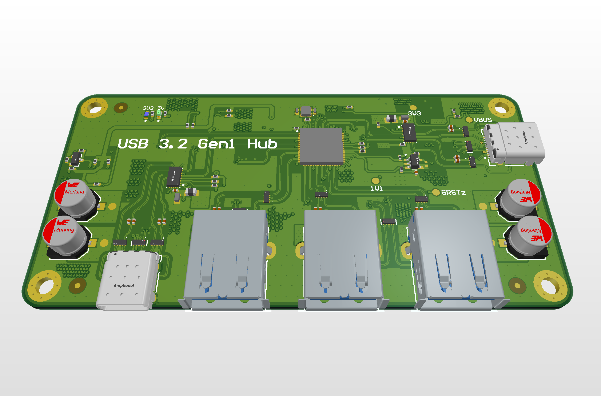
</p>

<p align="center">
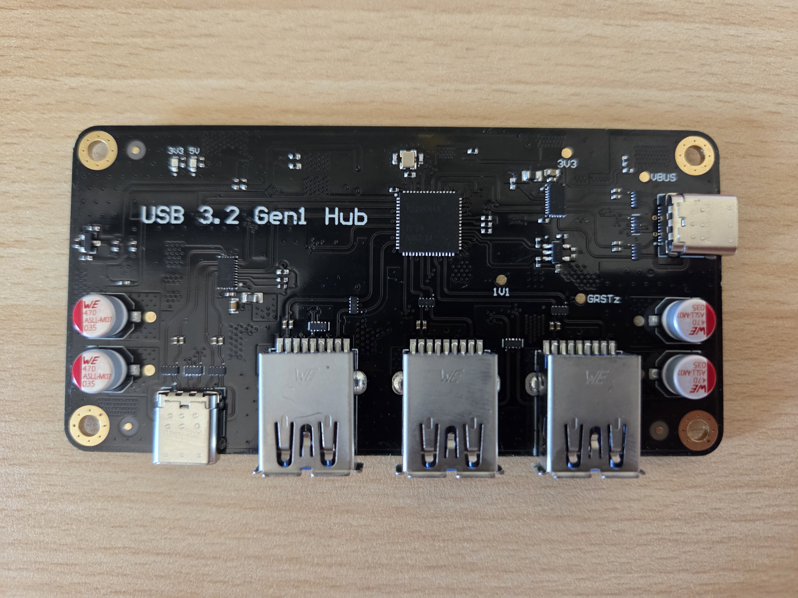
</p>

---

## 🎯 Project Goal

This project started as a question: could I take a commercially relevant USB 3.x system from architecture all the way through to a manufacturable, impedance-controlled 6-layer PCB?

The hub is built around the Texas Instruments **TUSB8044A**, fully bus-powered over USB-C, with one USB-C downstream port (cold-socket compliant) and three USB-A ports, each with independent current limiting. Type-C attach detection, power-up sequencing and overcurrent handling are implemented entirely in hardware, with no microcontroller required.

The areas I specifically wanted to get right:

- Routing 5 Gbps SuperSpeed differential pairs with impedance control
- Understanding the 6-layer stackup advantages
- Implementing USB-C cold socket behavior correctly, in hardware, per spec
- Getting power-up sequencing timing right against the TUSB8044A'sdatasheet requirements

---

## 🚀 Project Status

- [x] Architecture & component selection
- [x] Schematic capture (hierarchical, multi-sheet)
- [x] Signal integrity analysis & stackup design
- [x] PCB layout & routing
- [x] Manufacturing files (Gerbers, BOM, Pick & Place)
- [x] DFM review (PCBWay)
- [x] PCB fabrication & assembly
- [x] Bring-up & validation

---

## 🧩 Board Features

| Feature | Description |
|---|---|
| ⚡ USB 3.2 Gen 1 | 5 Gbps SuperSpeed, 4-port hub (TUSB8044A) |
| 🔌 USB-C UFP | Bus-powered upstream, 5V/3A max |
| 🧊 Cold Socket | Hardware VBUS gating on USB-C downstream port |
| 🔋 BC1.2 CDP | Charging support on all downstream ports |
| 🛡️ ESD Protection | All USB data lines, CC lines, and VBUS protected |
| 📡 Controlled Impedance | 90Ω differential SS/HS routing, 6-layer stackup |
| 🔄 Power Sequencing | Hardware-controlled, RC-delayed reset |
| 🧠 No MCU | All Type-C and power logic implemented in hardware |

---

## 🏆 Engineering Highlights

### 📡 Signal Integrity — 90Ω Differential Impedance

All SuperSpeed and High-Speed differential pairs are routed exclusively on **L1 and L6**, each directly referenced to a solid, unbroken GND plane (L2 and L5). Routing follows the 5W rule, a minimum of 0.6mm clearance between any differential pair and other signals or copper pour, preventing nearby copper from acting as a parasitic coplanar ground and shifting the impedance off target.

| Parameter | SuperSpeed (USB 3.x) | High-Speed (USB 2.0) |
|---|---|---|
| Target differential impedance | 90Ω ±10% | 90Ω ±10% |
| Intra-pair skew | ≤ 0.15mm (≈1.2ps) | ≤ 3.8mm |
| Max via count per pair | 2 | 4 |
| AC coupling | 100nF, 0402, X7R — TX paths only | — |

<p align="center">
  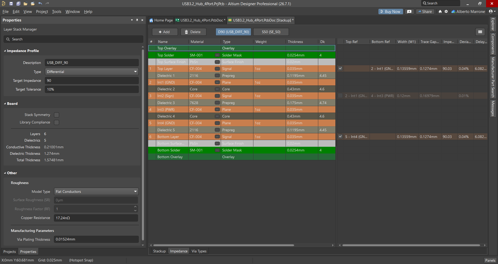
</p>

> [!TIP]
> Both the TUSB8044A and HD3SS3220 support **native polarity inversion** on
> SuperSpeed pairs — P/N can be swapped freely during routing with no via
> tricks or register configuration required.

---

### 🧱 6-Layer Stackup Selection

| Layer | Type | Function |
|---|---|---|
| L1 | Signal | High-speed routing & components |
| L2 | GND Plane | Solid reference |
| L3 | Signal | Low-speed control signals |
| L4 | Power Plane | 5V / 3.3V / 1.1V |
| L5 | GND Plane | Solid reference |
| L6 | Signal | High-speed routing & components |

Both signal layers carrying HighSpeed and SuperSpeed traffic (L1 and L6) sit directly against a solid GND plane. Slow control signals are confined to L3, sandwiched between a GND plane (L2) and the power plane (L4), shielding them from both the high-speed layers and external noise.

> [!NOTE]
> The prepreg between L1–L2 and L5–L6 uses **2116 weave** instead of the
> coarser 7628. The finer glass weave reduces the fiber-weave effect,
> keeping the dielectric more homogeneous under the SuperSpeed pairs and
> minimizing intra-pair skew. Full reasoning, including why 6 layers over
> 4, and why an LDO over a second buck for the 1.1V rail, is documented in
> [`Docs/Design_Decisions.md`](Docs/Design_Decisions.md).

---

### 🔌 USB-C Cold Socket Compliance

Per the USB Type-C specification, the downstream USB-C port's VBUS must remain de-energized until a cable is detected, unlike USB-A ports, which are permitted to be hot-socket. This is implemented with a single P-MOSFET acting as a hardware enable gate, requiring no firmware:

- **Source** → PWRCTL1 (TUSB8044A, 3.3V when hub is active)
- **Gate** → ID pin of the downstream HD3SS3220
- **Drain** → EN1 of the TPS2561 power switch

With no cable inserted, the ID pin floats and a 100kΩ gate-source resistor holds the MOSFET off, VBUS stays at 0V. On attach, the HD3SS3220 detects the termination on CC and pulls ID low, turning on the MOSFET and enabling VBUS. The three USB-A ports use direct PWRCTL → EN connections, as hot-socket behavior is permitted there.

---

### 🔋 Power Budget

The hub negotiates 3A from the upstream USB-C port. Hub control circuitry and always-on rails consume a portion of this budget, leaving the remainder for the four downstream ports.

| Item | Current |
|---|---|
| Upstream budget (USB-C UFP, 3A negotiated) | 3000 mA |
| Hub controller + support circuitry | ≈ 582 mA |
| Available for downstream ports | ≈ 2418 mA |
| Ports 1–2 limit (TPS2561 #1, R_ILIM = 37.4kΩ) | 1.5 A each |
| Ports 3–4 limit (TPS2561 #2, R_ILIM = 56kΩ) | 1.0 A each |
| Sum of all port limits (worst case, all ports active) | 5.0 A |

> [!NOTE]
> The sum of individual port limits (5A) exceeds the available downstream
> budget (2.418A). This is an accepted worst-case scenario: simultaneous
> maximum draw on all four ports is unlikely in practice, and the upstream
> host's own port protection provides a final safeguard if the negotiated
> 3A is exceeded.

---

### ⏱️ Power Sequencing

> [!IMPORTANT]
> The TUSB8044A requires GRSTz to remain asserted for ≥3ms after both VDD
> (1.1V and 3.3V) enter their recommended operating range.

| Event | Time |
|---|---|
| VBUS 5V applied | 0 ms |
| Buck PG asserted → LDO enabled | ≈ 0.5 ms |
| LDO soft-start complete (Css = 2.2nF, tSS ≈ 3.3ms) | ≈ 3.8 ms |
| LDO PG released → RC delay begins | ≈ 4.3 ms |
| GRSTz reaches V_IH → TUSB8044A exits reset | ≈ 16 ms |

The RC delay accounts for the TUSB8044A's internal pull-up on GRSTz (R_int ≈ 14.5–25kΩ): with an external 100kΩ resistor and a 1µF capacitor, R_eq ≈ 12.66kΩ. The time delay is comfortably above the 3ms minimum required after both supplies are stable.

> [!NOTE]
> The measured GRSTz de-assertion delay from VBUS rise to the logic-high threshold is **tGRSTz = 42.6 ms**
> This delay is dominated by the TUSB8044A internal reset release mechanism and the external reset network.
> The measured value confirms that GRSTz remains asserted long enough during power-up sequencing.
> The difference between the expected and measured timing is attributed to device tolerances,
> reset circuitry characteristics and measurement conditions.

<p align="center">
  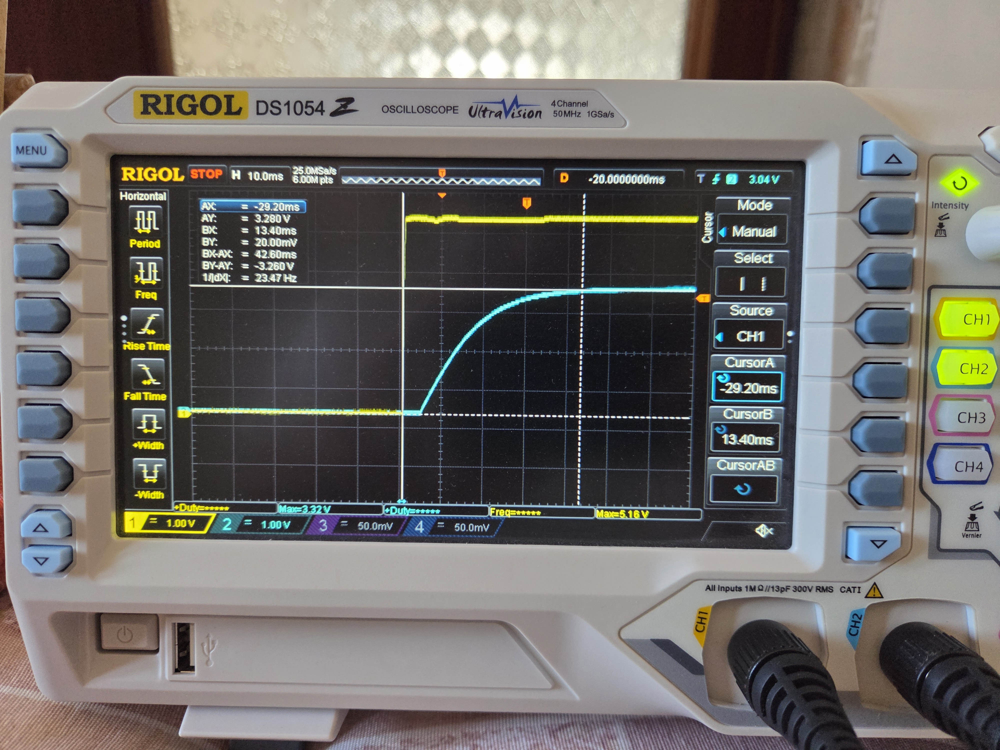
</p>
<p align="center"><em>Channel 1 — VBUS 5V.  Channel 2 — GRSTz.  tGRSTz = 42.6 ms from power-on.</em></p>

---

## 🖼️ Design Gallery

### Final Prototype

<p align="center">
  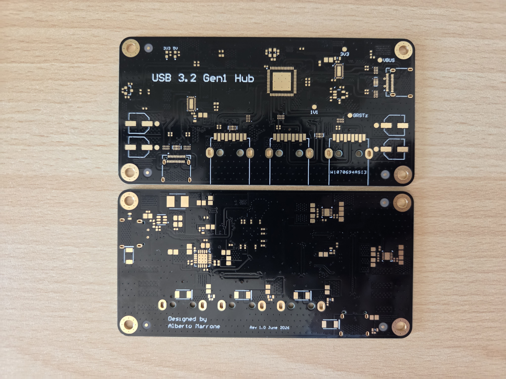
  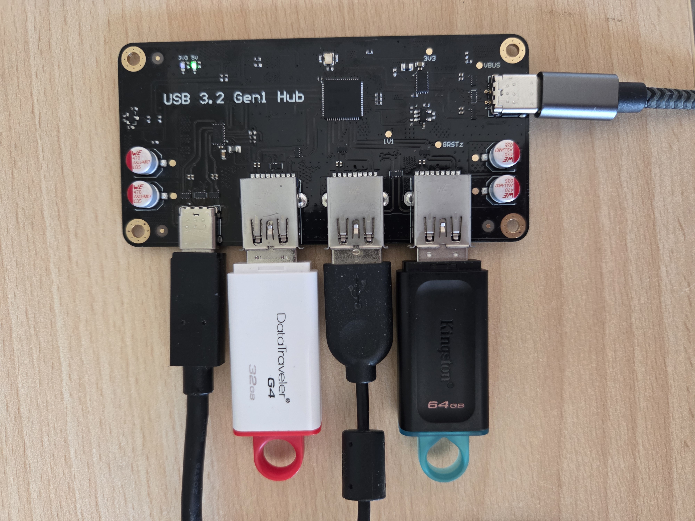
</p>

### PCB Render

<p align="center">
  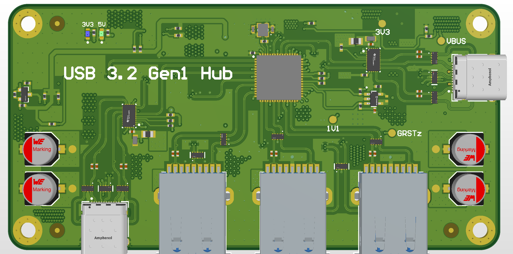
  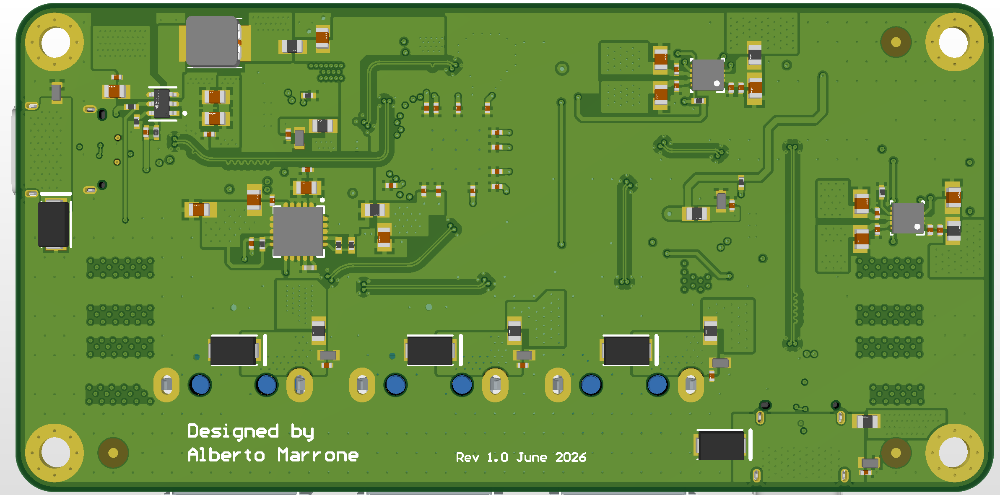
</p>

### Schematic Architecture

<p align="center">
  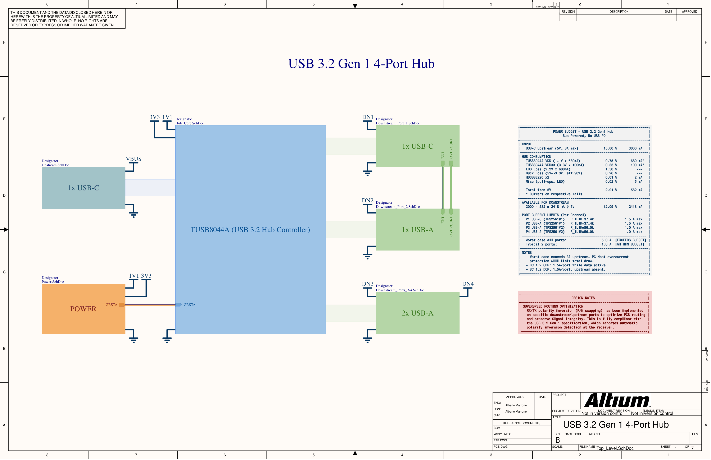
</p>

🔗 **Full schematic (PDF, all sheets):** [Schematic_USB_Hub_v1.0.pdf](Hardware/Exports/Schematic_USB_Hub_v1.0.pdf)

### Stackup Development

<p align="center">
  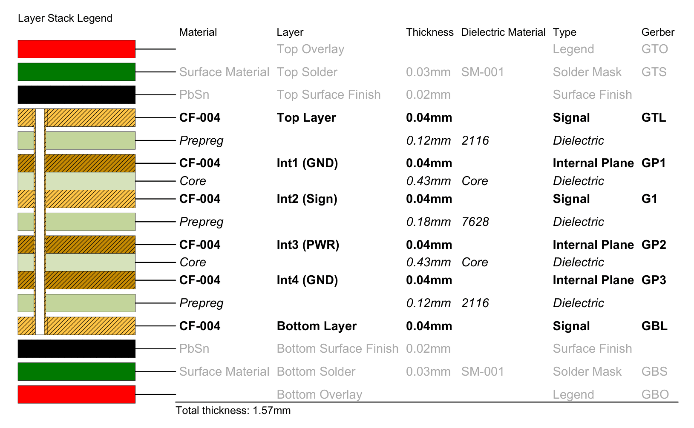
  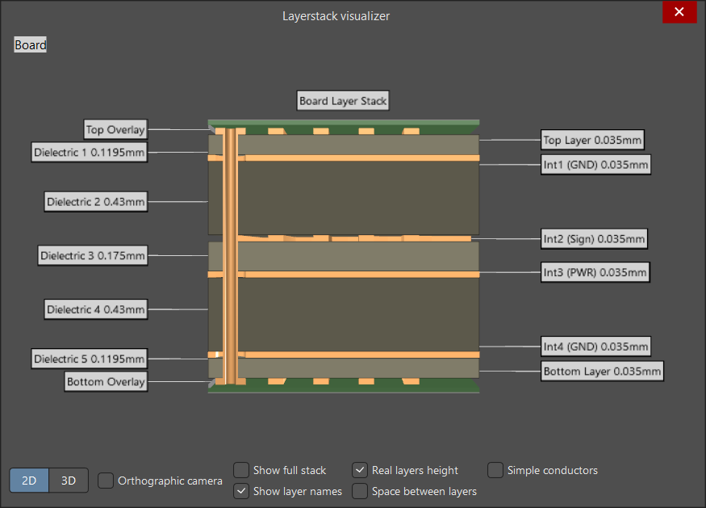
</p>

---

## 🔧 Hardware Specifications

| Parameter | Value |
|---|---|
| **Hub Controller** | TUSB8044A — USB 3.2 Gen 1, 5 Gbps, 64-pin VQFN |
| **Upstream Port** | USB-C (UFP/Sink, bus-powered, 5V/3A max) |
| **Downstream Ports** | 1× USB-C (DFP) + 3× USB-A |
| **Type-C Controllers** | 2× HD3SS3220IRNHT (UFP + DFP) |
| **Power Switches** | 2× TPS2561QDRCRQ1 (dual-channel, per-port current limiting) |
| **Power Tree** | 5V → 3.3V (TLV62569PDDCT buck, 2A) → 1.1V (TPS74801RGWRM3 LDO, 1.5A) |
| **Battery Charging** | BC 1.2 CDP enabled on all downstream ports |
| **Cold Socket** | DMG2305UX P-MOSFET on USB-C downstream port |
| **ESD Protection** | PUSB3FR4Z (SS), TPD4E05U06 (USB2.0/CC), SMAJ5.0A (VBUS) |
| **PCB Layers** | 6-layer, impedance-controlled |
| **Board Size** | 100 × 50 mm |

---

## 🤝 Manufacturing Partner

This prototype was fabricated and assembled by <a href="https://www.pcbway.com"></a>.

The manufacturing process included a standard engineering review prior to production. During this review, the PCBWay engineering team identified a via-in-pad condition that could affect assembly yield. The issue was corrected before fabrication, avoiding an unnecessary prototype revision.

The finished boards met the specified impedance-controlled stackup and assembly requirements. Visual inspection of the assembled prototype showed good component alignment and solder quality, including the 0.5 mm-pitch VQFN packages used by the TUSB8044A and HD3SS3220 devices, with no observable solder bridges or placement defects.

---

## ✅ Bring-Up Results

Validation was performed on the first prototype assembled by PCBWay.
Full procedure and raw measurements are documented in [`Docs/Bringup_Procedure.md`](Docs/Bringup_Procedure.md).

### Power Rails

All rails measured at test points with no downstream load.

| Rail | Target | Measured | Status |
|---|---|---|---|
| VBUS (upstream input) | 5.000 V | 5.018 V | ✅ |
| VDD33 | 3.300 V | 3.325 V | ✅ |
| VDD (1.1V LDO) | 1.100 V | 1.097 V | ✅ |
| GRSTz (at de-assertion) | — | 3.265 V | ✅ |
| VBUS downstream USB-A | 5.000 V | 5.018 V | ✅ |

Idle power consumption (hub only, no downstream devices): **0.02 A @ 5.041 V → 0.1 W.**

### USB Enumeration

Both logical hub interfaces enumerate correctly on the first attempt:

| Interface | PID | Speed | Status |
|---|---|---|---|
| USB 2.0 HS hub | 0x8442 | 480 Mbit/s | ✅ |
| USB 3.x SS hub | 0x8440 | 5 Gbit/s | ✅ |
| HID-to-I2C bridge | 0x82FF | HS | ✅ |

EEPROM custom USB descriptors were successfully programmed and verified after enumeration:

```text
Manufacturer : Alberto Marrone
Product      : USB 3.2 Gen1 4-Port Hub
Serial       : F10100616729  (TI factory UUID)
```

<p align="center">
  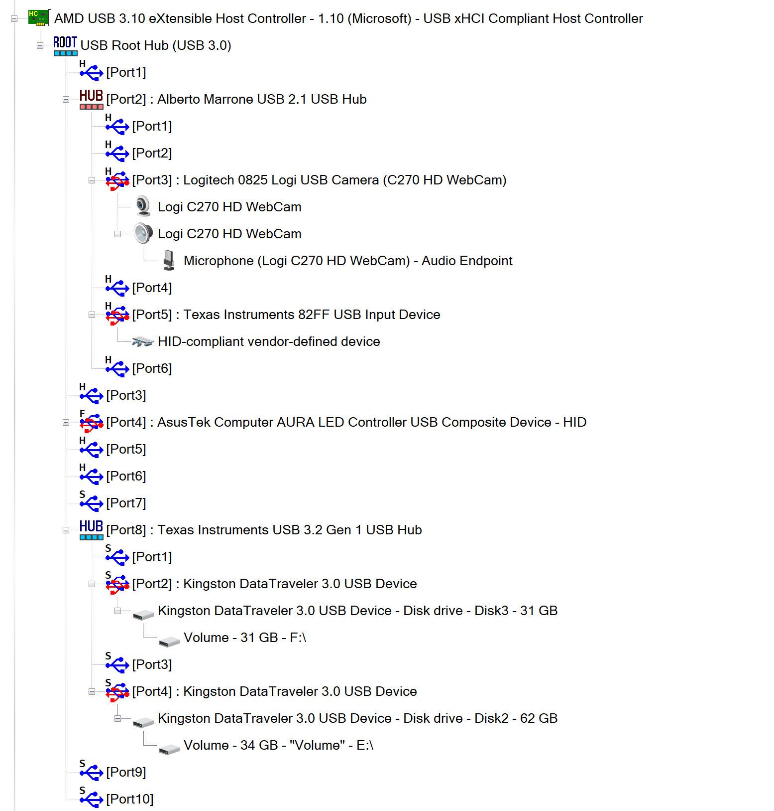
</p>
<p align="center"><em>UsbTreeView — HS hub and SS hub.</em></p>

### SuperSpeed Performance

Validated using USBDeview on a Kingston DataTraveler 3.0 device.

| Metric | Value |
|---|---|
| Sequential read | **102.86 MB/s** |
| Sequential write | 16.36 MB/s |

Read throughput of 102 MB/s is incompatible with USB 2.0 High-Speed (theoretical max ≈ 40 MB/s), confirming the SuperSpeed (5 Gbit/s) link is established end-to-end.

<p align="center">
  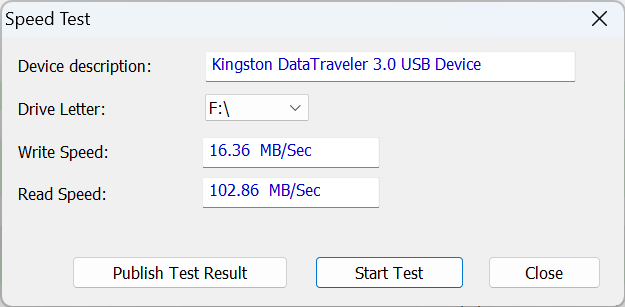
</p>

### Other Tests

- [x] Visual inspection (0.5 mm-pitch QFN solder joints, connectors)
- [x] GRSTz power-on timing (42.6 ms — see [Power Sequencing](#%EF%B8%8F-power-sequencing))
- [x] Per-port functional test — all 4 ports enumeration confirmed
- [x] USB 2.0 device compatibility
- [x] USB 3.0 device compatibility
- [x] Hot-plug on all four ports
- [x] USB-C cold socket — VBUS held at 0 V until cable attach confirmed
- [x] BC1.2 CDP charging verified

> [!NOTE]
> During continuous operation with multiple downstream devices connected, the TUSB8044A hub controller and the HD3SS3220
> controller run warm to the touch. Adding a small heatsinks or improving airflow is recommended for prolonged high-load operation.

---

## 🔧 EEPROM Configuration

The TUSB8044A reads a Microchip **24LC08BT-I/OT** EEPROM (8 Kbit, SOT-23) at power-up to load
custom USB descriptors and port configuration. Programming is performed via the chip's internal
**HID-to-I2C bridge** (VID `0x0451`, PID `0x82FF`) — no external programmer required.

Two Python utilities are provided in [`Scripts`](Scripts/):

| Script | Purpose |
|---|---|
| `TUSB8044A_EEPROM_WRITE.py` | Writes the full configuration and verifies every byte before activating |
| `TUSB8044A_EEPROM_READ.py` | Reads all 1024 bytes, prints a register-annotated hex dump, saves a `.bin` |

### Requirements

```bash
pip install hidapi
```

On Windows, run CMD as **Administrator** (required for raw HID access).

### Write — program the hub

Edit the `USER CONFIGURATION` block at the top of `TUSB8044A_EEPROM_WRITE.py`:

```python
MANUFACTURER = "Alberto Marrone"          # manufacturer string (max 32 chars)
PRODUCT      = "USB 3.2 Gen1 4-Port Hub"  # product string (max 32 chars)

VID_HUB      = 0x0451                     # keep TI VID for prototypes
PID_HUB      = 0x8440                     # TUSB8044A SS hub PID

BC12_MASK    = 0x0F                       # BC1.2 CDP enable mask (0x0F = all 4 ports)
```

Then run:

```bash
python TUSB8044A_EEPROM_WRITE.py
```

The 0x55 signature byte that activates the configuration is written only after all registers and strings have been verified. If interrupted, the hub safely falls back to TI factory defaults.

### Read — dump and inspect the EEPROM

```bash
python TUSB8044A_EEPROM_READ.py
```

Outputs a hex dump of Bank 0 (configuration registers + strings), annotates every key
register, decodes the manufacturer/product strings, and saves the full 1024-byte image
to `TUSB8044A_EEPROM.bin` in the working directory.

### Recovery

If the hub shows **"Unknown USB Device"** after a failed write: short EEPROM U6 **pin 3 (SDA)
to pin 2 (GND)** while inserting the USB cable. The TUSB8044A I2C read times out, the hub
boots from TI factory defaults, and the write utility can be re-run.

---

## 📚 Lessons Learned

This project provided practical experience beyond schematic capture and PCB layout, particularly in areas that are rarely covered in university courses:

- Designing a 6-layer controlled-impedance PCB for 5 Gbit/s differential routing.
- Translating impedance targets into manufacturable trace geometries using field-solver calculations.
- Understanding USB Type-C electrical requirements, including cold-socket behavior implemented entirely in hardware.
- Designing reliable power sequencing while accounting for internal IC behavior (such as GRSTz pull-up tolerance), not only the external RC network.
- Developing EEPROM programming and recovery tools through the TUSB8044A HID-to-I²C interface.
- Working through a real manufacturing DFM review with the PCB manufacturer before fabrication.
- Validating the completed hardware through electrical measurements, USB enumeration, and functional testing.

---

## ⬇️ Downloads

| File | Description |
|---|---|
| [Schematic (PDF)](Hardware/Exports/Schematic_USB_Hub_v1.0.pdf) | Full schematic, all sheets |
| [Draftsman Export (PDF)](Hardware/Exports/Draftsman_USB_Hub_v1.0.pdf) | Stackup, layers, 3D views |
| [Gerbers](Manufacturing/Gerbers/Gerber_USB3.2_Hub_4Port_v1.0.zip) | Production-ready Gerber + drill files |
| [BOM](Manufacturing/Assembly/BOM.xlsx) | Bill of materials |
| [Pick & Place](Manufacturing/Assembly/PickPlace.csv) | Assembly placement file |
| [PCBWay Stackup Reference (PDF)](Manufacturing/Stackup/PCBWay_6Layer_Stackup.pdf) | Manufacturer stackup |
| [EEPROM Write Tool](Scripts/TUSB8044A_EEPROM_WRITE.py) | Programs custom USB descriptor strings via HID-to-I2C |
| [EEPROM Read Tool](Scripts/TUSB8044A_EEPROM_READ.py) | Dumps and annotates full EEPROM contents |

---

## 📁 Repository Structure

```text
USB3.2-Hub-4Port/
│
├── Hardware/
│   ├── Altium/
│   │   ├── USB3.2_Hub_4Port.PrjPcb
│   │   ├── USB3.2_Hub_4Port.PcbDoc
│   │   ├── Top_Level.SchDoc
│   │   ├── Hub_Core.SchDoc
│   │   ├── Power.SchDoc
│   │   ├── Upstream.SchDoc
│   │   ├── Downstream_Port_1.SchDoc
│   │   ├── Downstream_Port_2.SchDoc
│   │   ├── Downstream_Port_3-4.SchDoc
│   │   ├── USB3.2_Hub_4Port.BomDoc
│   │   ├── USB3.2_Hub_4Port.PrjPcbVariants
│   │   └── USB3.2_Hub_4Port.PrjPcbStructure
│   │
│   └── Exports/
│       ├── Schematic_USB_Hub_v1.0.pdf
│       └── Draftsman_USB_Hub_v1.0.pdf
│
├── Manufacturing/
│   ├── Gerbers/
│   │   └── Gerber_USB3.2_Hub_4Port_v1.0.zip
│   │
│   ├── Assembly/
│   │   ├── BOM.xlsx
│   │   └── PickPlace.csv
│   │
│   └── Stackup/
│       ├── PCBWay_6Layer_Stackup.pdf
│       └── USB3.2_Hub_4Port_Stackup.png
│
├── Scripts/
│   ├── TUSB8044A_EEPROM_WRITE.py
│   └── TUSB8044A_EEPROM_READ.py
│
├── Docs/
│   ├── Design_Decisions.md
│   └── Bringup_Procedure.md
│
├── Images/               # PCB renders, prototype photos and bring-up measurements
│
└── README.md
```

---

## 📄 License

Released under the MIT License.

You are welcome to study, modify, manufacture, and build upon this design.

---

## 👤 Author

**Alberto Marrone**
MSc Student, Electronics Engineering — Politecnico di Milano
[LinkedIn](https://linkedin.com/in/alberto-marrone-444192274)

*This project is provided for educational and portfolio purposes.*
